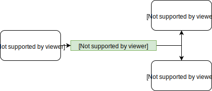
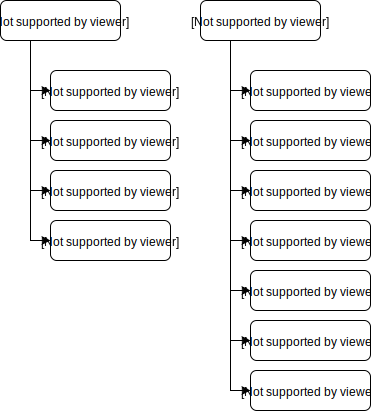
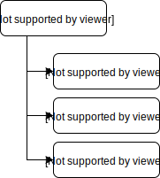

<h1 align="center">

:sunglasses: vromon

</h1>

***

### Requirements:
 * #### [Python 3.6 or up](https://www.python.org/downloads/release/python-372/)
 * #### Database : PostgreSQL, MySQL, OracleDB
   * ##### [PostgreSQL with pgAdmin](https://www.enterprisedb.com/downloads/postgres-postgresql-downloads)

***
### How to work:
 * Clone the project
 * Open command line in project base dir and install all dependency
   > `pip install -r requirements.txt`
   
### Database setup:
By default we are using postgreSQL.For using any other relational database please install the package of that database
for django and change the database dependency on `settings.py`.

### Some django keyword:
* To migrations the model:
  > `python manage.py makemigrations [app_name]`
 
* To migrate the models to Database:
  > `python manage.py migrate`
  
* To run the project in localhost:
  > `python manage.py runserver`

***

### Models:
#### `User Model`

#### `Profile Model`

#### `Spot Model`

